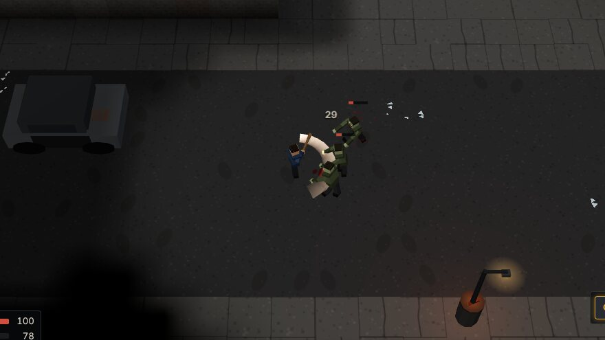
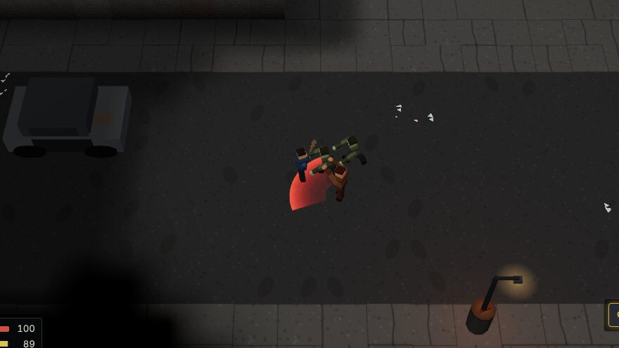
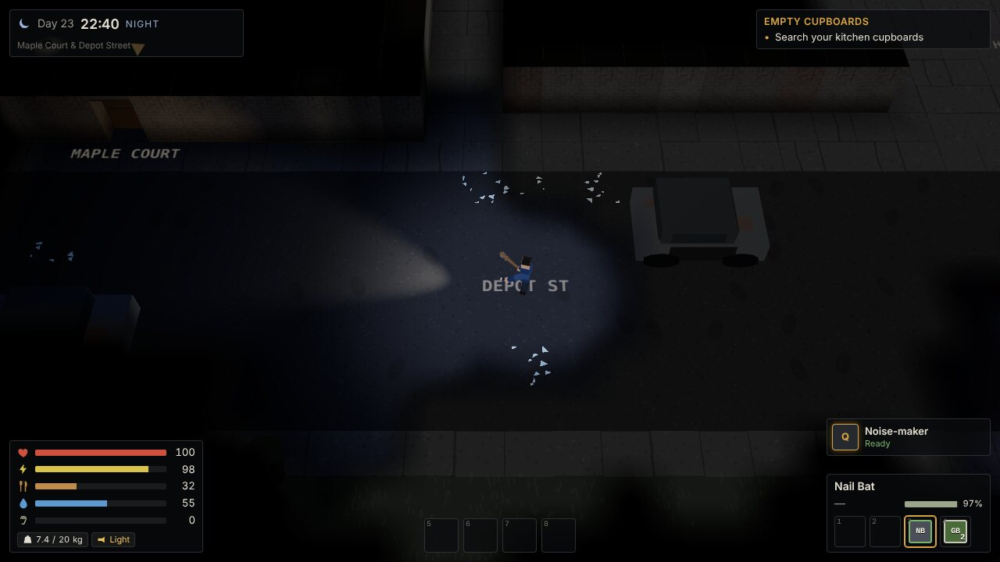
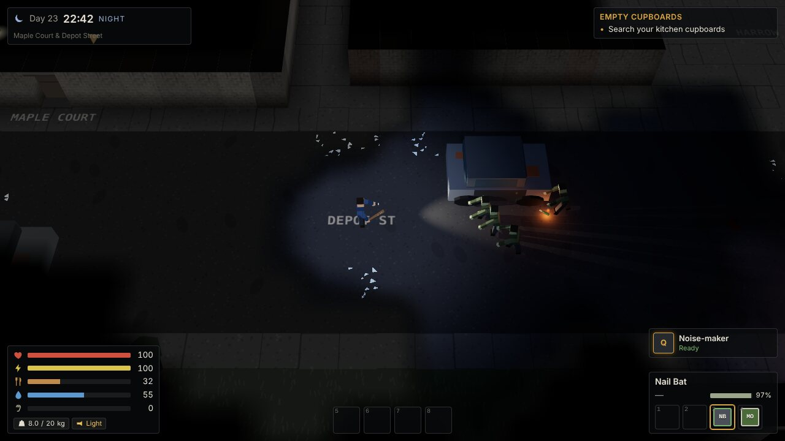
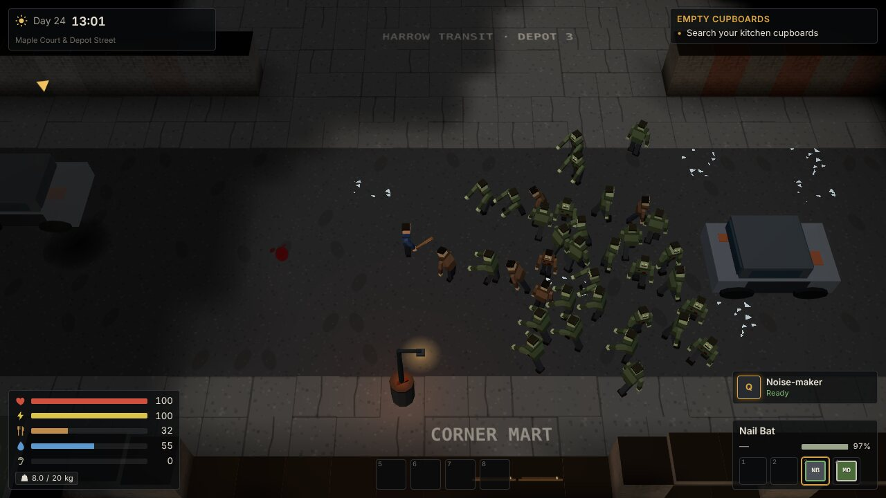
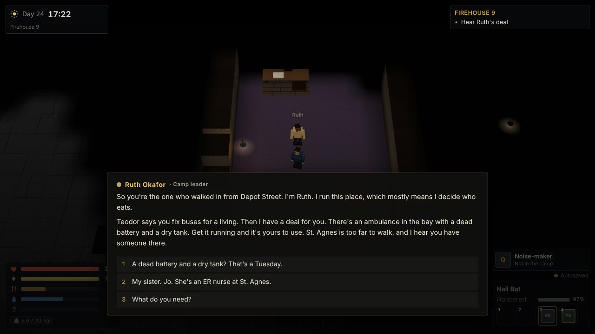
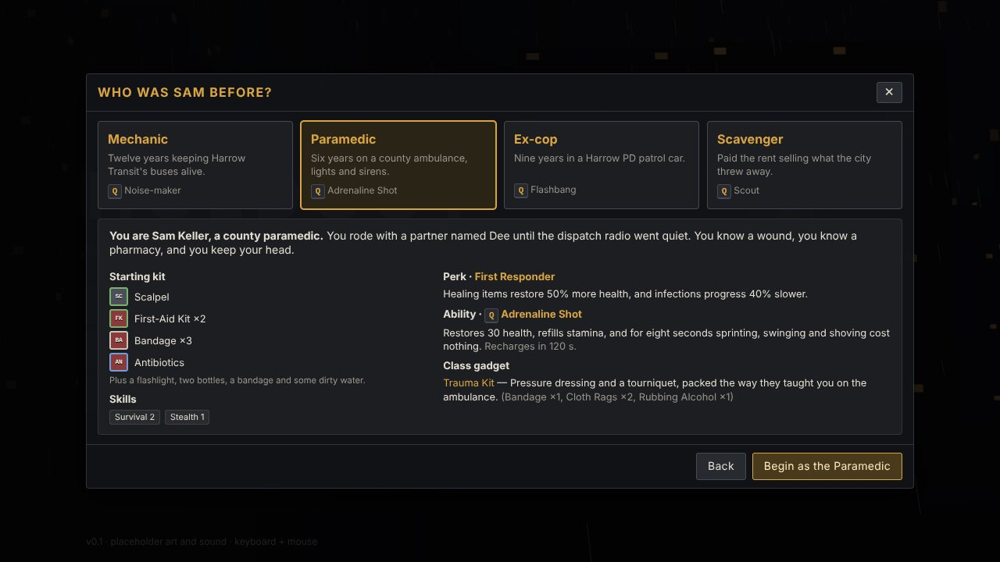
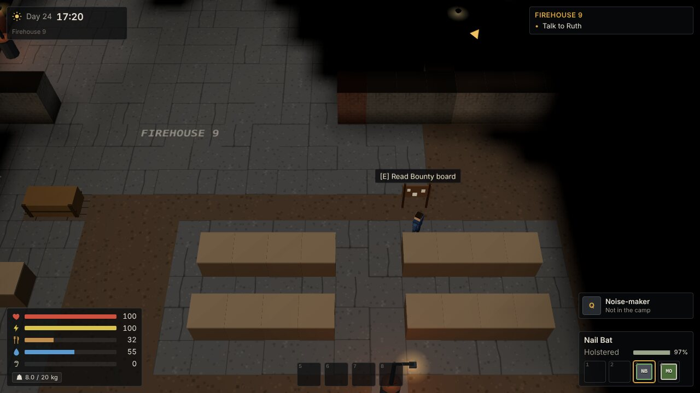

# HOLDOUT

A zombie survival RPG for desktop browsers (keyboard + mouse), seen from a 3D angled camera. Day 23: the
food ran out this morning. Play Sam — a bus mechanic, a paramedic, an ex-cop or a scavenger — holed up in
an apartment on Depot Street in Harrow City: scavenge the dark, find the Firehouse 9 camp, and follow your
sister Jo's trail to St. Agnes Hospital.

Every core system works end to end — line of sight and darkness, noise and stealth, zombies, melee and
guns, scavenging and weight, survival needs, crafting and weapon mods, classes with active abilities, NPCs
with branching dialogue, quests, barter, the safehouse, the world map with travel events and fuel, and
saves. The 3D view is rendered with three.js; all models, textures and sounds are generated in code as
placeholders that real assets can replace.

| | |
|---|---|
|  |  |
|  |  |
|  |  |
|  |  |

More in [docs/screenshots](docs/screenshots) (v1's 2D look is kept in [docs/screenshots/v1](docs/screenshots/v1)).

## Run it

Requires Node 22+.

```bash
npm install
npm run dev          # http://localhost:5173 — dev tools enabled
```

Production build and preview (served under `/game/`, like GitHub Pages):

```bash
npm run build
npm run preview      # http://localhost:4173/game/
```

The renderer picks a quality tier from the GPU: **HIGH** (shadows, antialiasing, more lights) or **LOW**
(software renderers such as SwiftShader/llvmpipe in CI). Force one with `?quality=high` or `?quality=low`.
`?renderer=2d` (or a browser without WebGL) uses a simple top-down Canvas2D fallback that keeps the game
playable.

Checks (run before every commit):

```bash
npm run check             # typecheck + lint + unit tests + content validation
npm run test:e2e          # Playwright: smoke, every key screen, and screenshots of the 3D view
                          # (to e2e/screenshots; needs `npx playwright install chromium` once)
npm run validate:content  # just the content validator
```

A scripted player plays the prologue and Act 1 with keyboard and mouse only (no debug commands), logging
every stage, fight and trade and taking screenshots along the way. It takes 10–15 minutes under software
WebGL:

```bash
npm run build && npm run preview &
node scripts/playthrough/play.mjs playthrough-out '&quality=low' mechanic
```

### GitHub Pages

`.github/workflows/deploy.yml` builds and deploys `main` to GitHub Pages. **Pages has to be enabled in the
repository settings** (Settings → Pages → Source: GitHub Actions) before the first deploy works. Vite's
`base` is `/game/` to match the repository name; change it in `vite.config.ts` if the repo is renamed.

## How to play

Start a **New Game**, pick a difficulty (Story, Survivor or Hardcore), then Sam's background:

| Class | Kit | Perk | Q ability |
|---|---|---|---|
| **Mechanic** | pipe wrench, toolbox, duct tape, pipe-pistol blueprint · Crafting 2, Melee 1 | *Grease Monkey*: repairs cost half and wear less, crafting 40% faster, gets the ambulance running 3× faster | **Noise-maker** (60 s): throw a beeping decoy that pulls walkers for 10 s |
| **Paramedic** | scalpel, 2 first aid kits, bandages, antibiotics · Survival 2, Stealth 1 | *First Responder*: healing items +50%, infections 40% slower | **Adrenaline Shot** (120 s): +30 HP, full stamina, 8 s of free sprinting, swinging and shoving |
| **Ex-cop** | 9mm pistol + 12 rounds, police baton · Firearms 2, Melee 1 | *Range Time*: firearms +15% damage, 25% faster reloads, 20% less spread | **Flashbang** (60 s): stuns zombies near the blast for 3 s (loud) |
| **Scavenger** | crowbar, 4 lockpicks, hiking pack · Scavenging 2, Stealth 1 | *Light Fingers*: searching 35% faster, quieter footsteps, extra finds | **Scout** (45 s): for 8 s see unsearched containers and zombies within 20 tiles through walls |

Each class also has a class-only gadget recipe, its own lines in Act 1 conversations, and story text that
knows what Sam did for a living. The prologue walks you through the basics with hints: search your kitchen,
find food, deal with the walker in the stairwell, build a nail bat at the depot workbench and make your way
to Firehouse 9. From there, Ruth's main quest and the camp's side quests take over.

| Key | Action |
|---|---|
| WASD | Move |
| Mouse | Aim (the camera leans toward the cursor) |
| LMB | Attack (melee swing / fire) |
| RMB | Aim mode: tighter spread, slower movement, the camera leans further |
| Q | Class ability (cooldown shown bottom right; not in the safehouse) |
| R | Reload (the shotgun loads shell by shell; R also clears a jammed crude gun) |
| E | Interact: doors, talking, pickups; **tap** to search a container (a short search runs on its own); **hold** to pick locks, cut chains, siphon fuel, repair |
| Shift + E (hold) | Force a lock with a crowbar (fast, loud) |
| Shift | Sprint |
| C | Crouch / sneak |
| Space | Shove (pushes zombies back, no damage) |
| 1–4 / mouse wheel | Weapon slots: firearm 1, firearm 2, melee, throwable |
| 5–8 | Quick-slot items |
| G | Throw the equipped throwable (bottle, molotov, pipe bomb, class gadgets) |
| F | Flashlight |
| Tab / I | Inventory (with the Craft, Skills and Journal tabs) |
| J | Journal (quests and notes) |
| M | Zone map (the world map opens at zone exits; the zone map has a view-only world map button) |
| K | Skills |
| H | Dismiss the current hint |
| Esc | Pause / close the current screen |

Tips:
- Zombies telegraph every swing: arms up, a red flush and a red fan on the ground showing their reach.
  Hit them first (every melee hit interrupts the wind-up) or step back out of the fan. Your weapon reaches
  further than they do; after a hit lands you have half a second of grace. Shove (Space) when two get close.
- Sound carries. Sprinting, gunfire, forcing locks and car alarms pull zombies in; walls muffle hearing.
  Crouch-walk up behind an unaware zombie for a ×3 sneak hit. Throw a bottle to lure a crowd away.
- You only see what Sam can see. Explored areas stay dimly remembered, but nothing moving shows in them.
  Walls between the camera and Sam are cut down so you never lose sight of yourself.
- Night falls at 21:00: vision shrinks, zombies are faster and more numerous, the flashlight helps you see
  and helps them see you.
- Hunger and thirst drain over time (faster while sprinting or fighting, and on long walks). Boil dirty
  water and cook raw food at a stove or campfire. Bandages stop bleeding; antibiotics fight infection.
- Saves: three manual slots (pause menu) plus an autosave on entering an area, at quest steps and when you
  sleep in your bunk. Saves can be exported and imported as files. Dying offers to load the latest save.

## Dev tools

Enabled in `npm run dev`, or in any build with `?debug=1` in the URL (e.g. `/game/?debug=1`).

- **F3** — debug overlay: FPS, frame/sim time, entity counts, zombie AI states, noise radii, paths.
- **`** (backtick) — console. `help` lists every command:

| Command | Does |
|---|---|
| `give <itemId> [qty]` / `items [filter]` | add items / list item ids |
| `heal`, `god`, `noclip` | full heal; toggle invulnerability; toggle walking through walls |
| `time <HH:MM>` / `time +<minutes>`, `timescale <x>` | set or advance the clock; speed it up |
| `tp <zoneId> [entry]`, `zones` | teleport to a zone; list zones |
| `travel <nodeId> [foot\|vehicle]` | travel on the world map (events can fire) |
| `spawn <enemyType> [n]`, `kill` | spawn enemies near you; kill every zombie in the zone |
| `quest <id> <stage>`, `flag <key> [value]` | start a quest / jump to a stage; set a story flag |
| `rep <n>`, `xp <n>`, `skill <id> <rank>` | set reputation (0–100), grant XP, set a skill rank |
| `class [id]` | show or switch Sam's class (perk and ability; the kit is unchanged); recharges Q |
| `fuel <liters>` | give the vehicle and set its fuel |
| `reveal` | reveal every world-map location and the current zone map |
| `save [slot]`, `load [slot]` | save to / load from `auto`, `slot1`–`slot3` |
| `fov`, `debug` | toggle fog of war; toggle the overlay |

The browser console also exposes `window.holdout` (`store`, `game`, and `cmd(line)` when dev tools are on).

## Where things live

| Path | What |
|---|---|
| `src/content/data/*.json`, `src/content/data/zones/*.json` | all game content (items, recipes, enemies, NPCs, dialogue, quests, traders, zones, world map, travel events, notes, radio, hints) — validated with zod at boot |
| `src/config/balance.ts` | every tunable number, plus difficulty presets |
| `src/sim/` | the zone simulation: tiles, FOV, collision, pathfinding, zombies, combat, abilities, interactions (no renderer code) |
| `src/systems/` | game rules on the `GameState`: inventory, survival, crafting, quests, dialogue, trade, travel, saves |
| `src/game/` | three.js: the 3D zone and title views, procedural models and textures, the asset manifest and overrides, input, audio, the Canvas2D fallback |
| `src/ui/` | Preact overlay: HUD and every screen |
| `tests/unit/`, `e2e/` | Vitest unit tests, Playwright smoke tests |
| `docs/` | [BRIEF](docs/BRIEF.md), [BRIEF_V2](docs/BRIEF_V2.md), [DESIGN](docs/DESIGN.md) (architecture + decisions), [ROADMAP](docs/ROADMAP.md) (status), [CONTENT_GUIDE](docs/CONTENT_GUIDE.md) |

Adding content (an item, weapon, recipe, enemy, class, NPC with dialogue, quest, trader or zone) is a data
edit, and real models and textures can replace the placeholders by asset key: see
[docs/CONTENT_GUIDE.md](docs/CONTENT_GUIDE.md).

Credits and licenses: [CREDITS.md](CREDITS.md).
