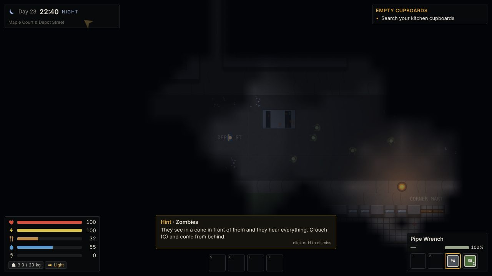
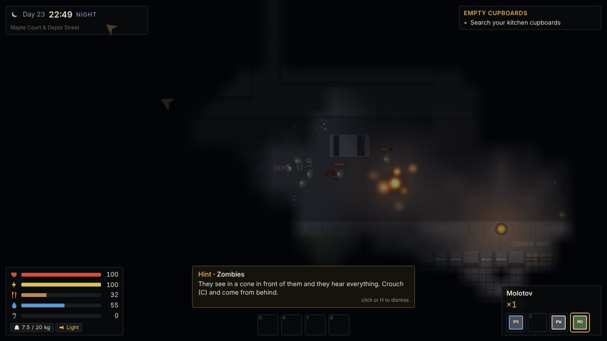
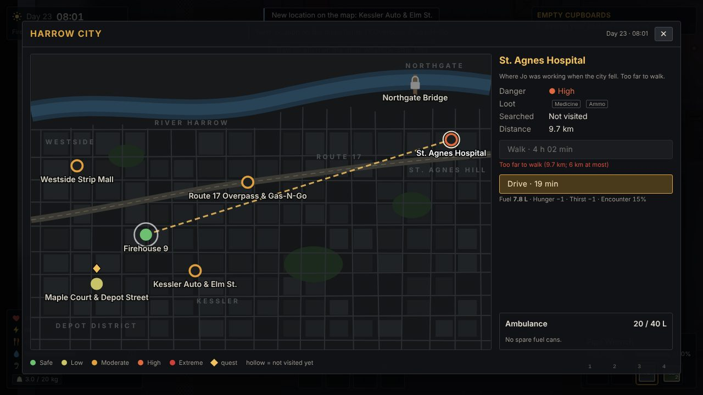
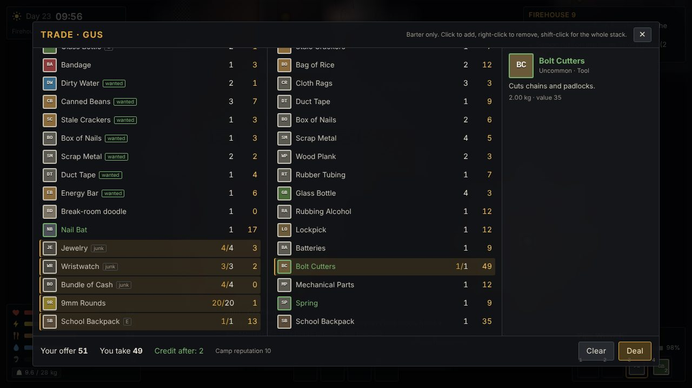
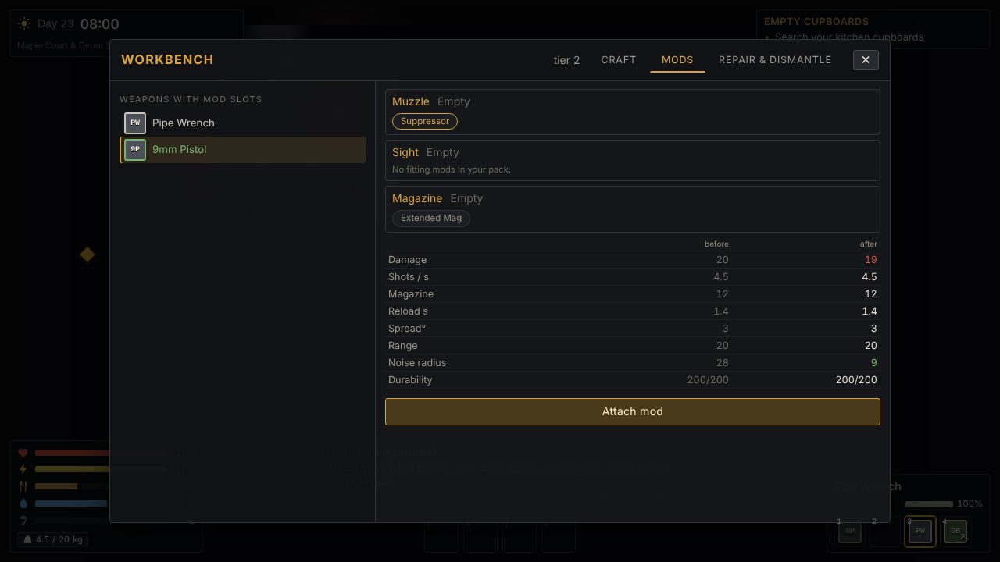
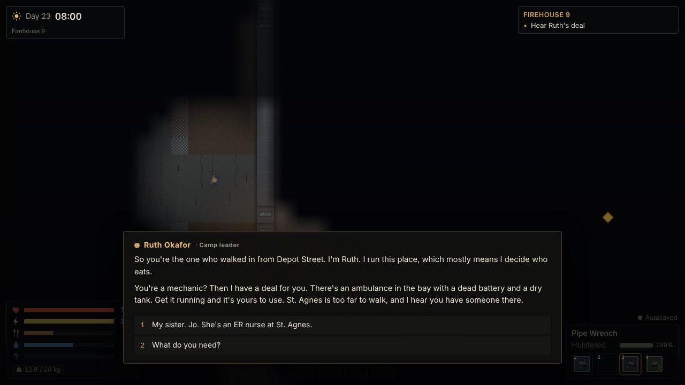

# HOLDOUT

A top-down zombie survival RPG for desktop browsers (keyboard + mouse). Day 23: the food ran out this
morning. Play Sam, a mechanic barricaded above a transit depot in Harrow City, scavenge the dark, find the
Firehouse 9 camp, and follow your sister Jo's trail to St. Agnes Hospital.

This is the first playable vertical slice: every core system works end to end — vision and darkness,
noise and stealth, zombies, melee and guns, scavenging and weight, survival needs, crafting and weapon
mods, NPCs with branching dialogue, quests, barter, the safehouse, the world map with travel events and
fuel, and saves. All art and sound are generated at boot as placeholders.

| | |
|---|---|
|  |  |
|  |  |
|  |  |

More in [docs/screenshots](docs/screenshots).

## Run it

Requires Node 22+.

```bash
npm install
npm run dev          # http://localhost:5173 — dev tools enabled
```

Production build and preview (served under `/game/`, like GitHub Pages):

```bash
npm run build
npm run preview      # http://localhost:4173/game/
```

Checks (run before every commit):

```bash
npm run check             # typecheck + lint + unit tests + content validation
npm run test:e2e          # Playwright smoke tests (needs `npx playwright install chromium` once)
npm run validate:content  # just the content validator
```

### GitHub Pages

`.github/workflows/deploy.yml` builds and deploys `main` to GitHub Pages. **Pages has to be enabled in the
repository settings** (Settings → Pages → Source: GitHub Actions) before the first deploy works. Vite's
`base` is `/game/` to match the repository name; change it in `vite.config.ts` if the repo is renamed.

## How to play

Start a **New Game** and pick a difficulty (Story, Survivor or Hardcore). The prologue walks you through
the basics with hints: search your kitchen, find food, deal with the walker in the stairwell, build a nail
bat at the depot workbench and make your way to Firehouse 9. From there, Ruth's main quest and the camp's
side quests take over.

| Key | Action |
|---|---|
| WASD | Move |
| Mouse | Aim |
| LMB | Attack (melee swing / fire) |
| RMB | Aim mode: tighter spread, slower movement, camera leans toward the cursor |
| R | Reload (the shotgun loads shell by shell; R also clears a jammed crude gun) |
| E | Interact: tap for doors, talking, pickups; **hold** to search containers and pick locks |
| Shift + E (hold) | Force a lock with a crowbar (fast, loud) |
| Shift | Sprint |
| C | Crouch / sneak |
| Space | Shove (pushes zombies back, no damage) |
| 1–4 / mouse wheel | Weapon slots: firearm 1, firearm 2, melee, throwable |
| 5–8 | Quick-slot items |
| G | Throw the equipped throwable (bottle, molotov, pipe bomb) |
| F | Flashlight |
| Tab / I | Inventory (with the Craft, Skills and Journal tabs) |
| J | Journal (quests and notes) |
| M | Zone map (the world map opens at zone exits; the zone map has a view-only world map button) |
| K | Skills |
| H | Dismiss the current hint |
| Esc | Pause / close the current screen |

Tips:
- Sound carries. Sprinting, gunfire, forcing locks and car alarms pull zombies in; walls muffle hearing.
  Crouch-walk up behind an unaware zombie for a ×3 sneak hit. Throw a bottle to lure a crowd away.
- You only see what Sam can see. Explored areas stay dimly remembered, but nothing moving shows in them.
- Night falls at 21:00: vision shrinks, zombies are faster and more numerous, the flashlight helps you see
  and helps them see you.
- Hunger and thirst drain over time (faster while sprinting or fighting, and on long walks). Boil dirty
  water and cook raw food at a stove or campfire. Bandages stop bleeding; antibiotics fight infection.
- Saves: three manual slots (pause menu) plus an autosave on entering an area, at quest steps and when you
  sleep in your bunk. Saves can be exported and imported as files. Dying offers to load the latest save.

## Dev tools

Enabled in `npm run dev`, or in any build with `?debug=1` in the URL (e.g. `/game/?debug=1`).

- **F3** — debug overlay: FPS, frame/sim time, entity counts, zombie AI states, noise radii, paths.
- **`** (backtick) — console. `help` lists every command:

| Command | Does |
|---|---|
| `give <itemId> [qty]` / `items [filter]` | add items / list item ids |
| `heal`, `god`, `noclip` | full heal; toggle invulnerability; toggle walking through walls |
| `time <HH:MM>` / `time +<minutes>`, `timescale <x>` | set or advance the clock; speed it up |
| `tp <zoneId> [entry]`, `zones` | teleport to a zone; list zones |
| `travel <nodeId> [foot\|vehicle]` | travel on the world map (events can fire) |
| `spawn <enemyType> [n]`, `kill` | spawn enemies near you; kill every zombie in the zone |
| `quest <id> <stage>`, `flag <key> [value]` | start a quest / jump to a stage; set a story flag |
| `rep <n>`, `xp <n>`, `skill <id> <rank>` | set reputation (0–100), grant XP, set a skill rank |
| `fuel <liters>` | give the vehicle and set its fuel |
| `reveal` | reveal every world-map location and the current zone map |
| `save [slot]`, `load [slot]` | save to / load from `auto`, `slot1`–`slot3` |
| `fov`, `debug` | toggle fog of war; toggle the overlay |

The browser console also exposes `window.holdout` (`store`, `game`, and `cmd(line)` when dev tools are on).

## Where things live

| Path | What |
|---|---|
| `src/content/data/*.json`, `src/content/data/zones/*.json` | all game content (items, recipes, enemies, NPCs, dialogue, quests, traders, zones, world map, travel events, notes, radio, hints) — validated with zod at boot |
| `src/config/balance.ts` | every tunable number, plus difficulty presets |
| `src/sim/` | the zone simulation: tiles, FOV, collision, pathfinding, zombies, combat, interactions (no Phaser) |
| `src/systems/` | game rules on the `GameState`: inventory, survival, crafting, quests, dialogue, trade, travel, saves |
| `src/game/` | Phaser: scenes, placeholder art generation, rendering, audio |
| `src/ui/` | Preact overlay: HUD and every screen |
| `tests/unit/`, `e2e/` | Vitest unit tests, Playwright smoke tests |
| `docs/` | [BRIEF](docs/BRIEF.md), [DESIGN](docs/DESIGN.md) (architecture + decisions), [ROADMAP](docs/ROADMAP.md) (status), [CONTENT_GUIDE](docs/CONTENT_GUIDE.md) |

Adding content (an item, weapon, recipe, enemy, NPC with dialogue, quest, trader or zone) is a data edit:
see [docs/CONTENT_GUIDE.md](docs/CONTENT_GUIDE.md).

Credits and licenses: [CREDITS.md](CREDITS.md).
